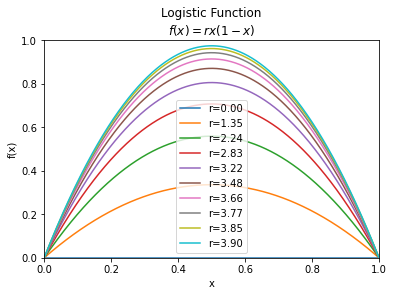
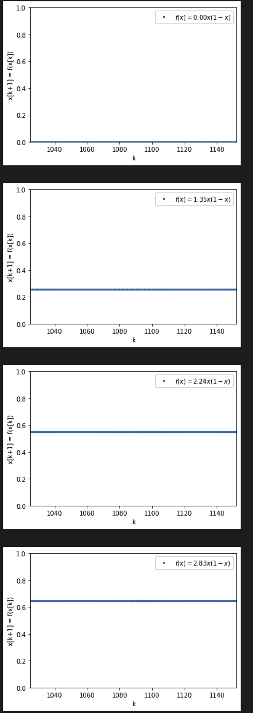
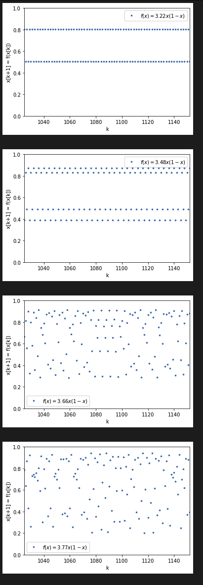
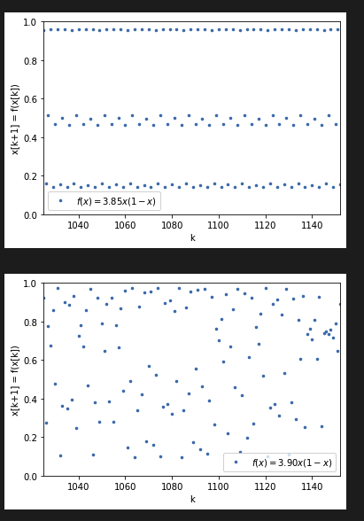
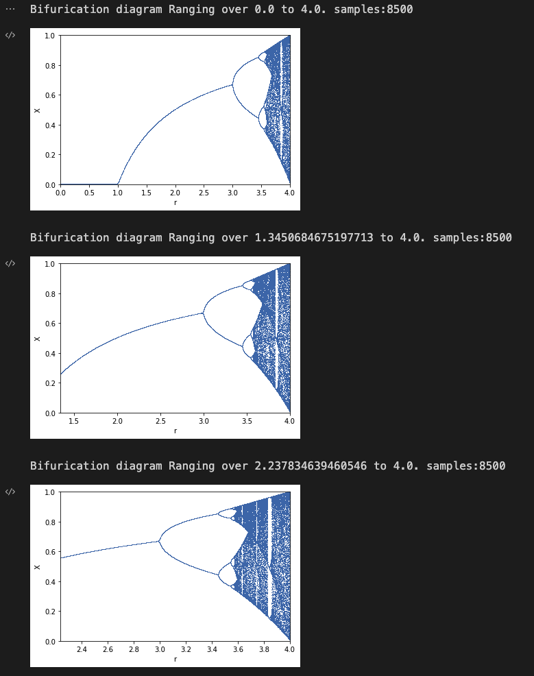
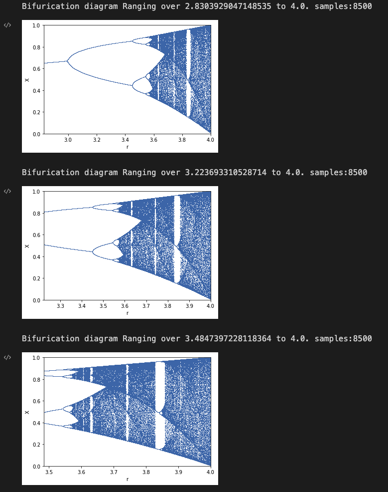
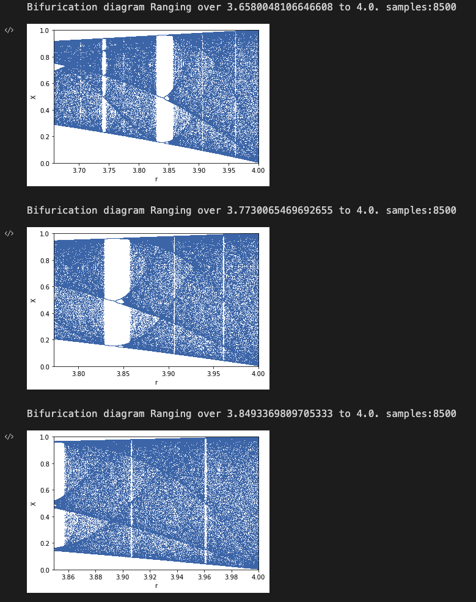
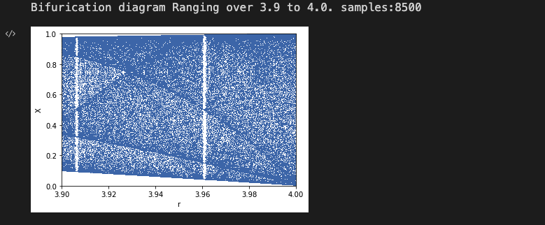
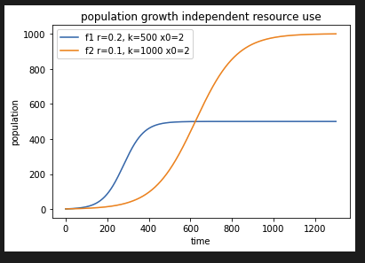
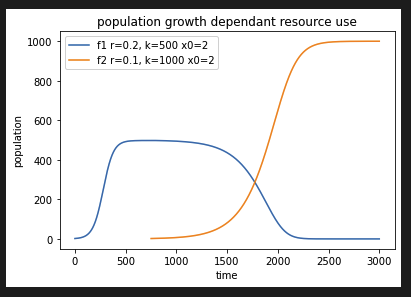

# Genetics and Evolution
## Ps1 Sols,

### P1: Bifurcation diagram of growth function
Diagrams:
* Logistic Function

* Continuous expansion of Logistic functions:

* Bifurcation diagram with different ranges.

### P2: Population growth
* Pop Growth Independent

* Pop Growth Dependent with orange efficiency (K param) bigger than Blue

